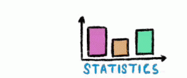

---
output:
  html_document:
    theme: flatly
    css: styles.css
---

<link rel="stylesheet" href="styles.css" type="text/css" />
<link rel="stylesheet" href="academicons/css/academicons.min.css"/>

 
 
 

### The Website for Happy Valley Meat Company
This website is more an consultant project, which help [Happy Valley Meat Company](https://www.happyvalleymeat.com/) to demonstrate their enviromental concept, which guide customer to choose their meat by considering environmental benefit. Using R shiny app to set up the website. 
 
[Learn More](website.html)

 
 

### Hypothesis Testing
Hypothesis testing is used to infer the result of a hypothesis performed on sample data from a larger population, which could tells the analyst whether or not his primary hypothesis is true.
Hypothesis testing have 4 steps. In order to obtain the p-value of the test, we could use different method based on the situation.
 
[Learn More](testing.html)

 
 

### Likelihood Function 
Maximum likelihood estimation (MLE) is a method of estimating the parameters of a probability distribution by maximizing a likelihood function, so that under the assumed statistical model the observed data is most probable (Wiki). In real world, the data we obtain are always the samples which would not have exact parameters, which we need to have an estimation to gather a most possible result.
 
[Learn More](likelihood.html)

 
 

### Poisson distribution and easier understand
Poisson distribution is one useful distribution in many cases. The binomial distribution and the Poisson distribution seem unrelated. But a closer look reveals a pretty interesting relationship. Most time I used it, I was confused how binomial distribution tends to poisson distribution. Then I write down this prove to remind myself how poisson distribution work.
 
[Learn More](possion.html)

 
 

