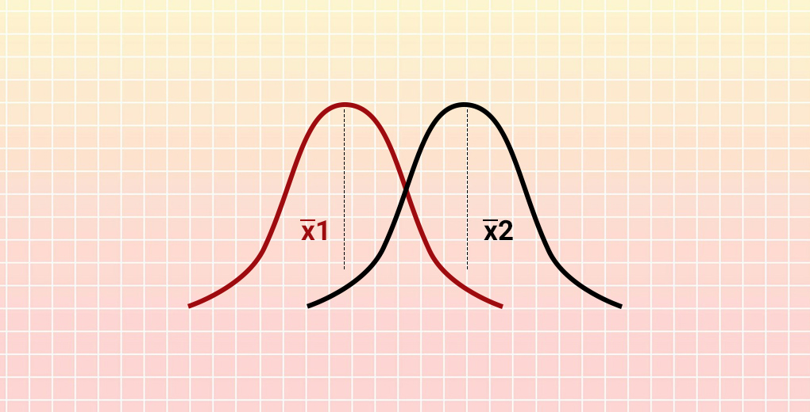

---
output:
  html_document:
    theme: flatly
    css: styles.css
---

<link rel="stylesheet" href="styles.css" type="text/css" />
<link rel="stylesheet" href="academicons/css/academicons.min.css"/>

  

 

### **4 steps of Hypothesis Testing**
1. Formulate the null hypothesis $H_0$ (commonly, that the observations are the result of pure chance) and the alternative hypothesis $H_a$ (commonly, that the observations show a real effect combined with a component of chance variation).

2. Identify a test statistic that can be used to assess the truth of the null hypothesis.

3. Compute the p-value, which is the probability that a test statistic at least as significant as the one observed would be obtained assuming that the null hypothesis were true. The smaller the P-value, the stronger the evidence against the null hypothesis.

4. Compare the p-value to an acceptable significance value $\alpha$ (sometimes called an alpha value). If $p\leq \alpha$, that the observed effect is statistically significant, the null hypothesis is ruled out, and the alternative hypothesis is valid.  

 

### **Method to test --- t.test**
$\cdot$ Single normal distribution OR Compariance of two normal distributions  
$\cdot$ For single normal distribution, if standard deviation($\sigma$) unknown, using 
`t.test(x,alternative,mu,conf.level)`  
$\qquad$x=data  
$\qquad$alternative = c("two.sided", "less", "greater")  
$\qquad$mu=a number indicating the true value of the mean  
$\qquad$conf.level $= 1-\alpha$  
$\cdot$ Comparing the **mean** of two given samples(assume normal distribution) using `t.test(x,y,alternative,mu,paired,conf.level)` $\qquad t-statistic=\frac{x_1-x_2}{\frac{\sigma}{\sqrt{n_1}}+\frac{\sigma}{\sqrt{n_2}}}$  
$\qquad$x=data_1  
$\qquad$x=data_2  
$\qquad$alternative = c("two.sided", "less", "greater")  
$\qquad$mu= difference in means  
$\qquad$conf.level $= 1-\alpha$  
$\qquad$paired: a logical indicating whether you want a paired t-test  

 

### **Method to test --- var.test**
$\cdot$ Comparing the **variance** of two given samples(assume normal distribution) using `t.test(x,y,ratio,alternative,conf.level)`
$\qquad$x=data_1  
$\qquad$x=data_2  
$\qquad$ratio= hypothesized ratio of the population variances of x and y  
$\qquad$alternative = c("two.sided", "less", "greater")  
$\qquad$conf.level $= 1-\alpha$  

 

### **Method to test --- binom.test**
$\cdot$ Single variable  
$\cdot$ Exact computation  
$\cdot$ `binom.test(x,n,p,alternative,conf.level)`  
$\qquad$x=success  
$\qquad$n=ntrails  
$\qquad$p=hypothesized probability of success  
$\qquad$alternative = c("two.sided", "less", "greater")  
$\qquad$conf.level $= 1-\alpha$  

 

### **Method to test --- prop.test**
$\cdot$ Single variable OR Several groups  
$\cdot$ Approximate computation  
$\cdot$ Single variable could be used to test single proportion  
$\cdot$ Several groups could be used to test the difference between samples in proportion  
$\qquad$ If p-value $<\alpha$, then there is sufficient evidence to against then null hypothesis, which proportions are same. Then they differ from each other.  
$\cdot$ `prop.test(x,n,p,alternative,conf.level,correct)`  
$\qquad$x=success OR a vector of counts of successes  
$\qquad$n=ntrails OR a vector of counts of trials  
$\qquad$p=hypothesized probability of success OR a vector of probabilities of success  
$\qquad$alternative = c("two.sided", "less", "greater")  
$\qquad$conf.level $= 1-\alpha$  
$\qquad$correct: If discrete will be `FALSE`, else will be `TRUE`, works no more than two groups  

 

### **Method to test --- chisq.test**
$\cdot$ Association between two samples in proportion  
$\cdot$ Approximate computation  
$\cdot$ Requirement to use Chi-square distribution  
$\qquad$ No more than $\frac{1}{5}$ of the cells have expected values $<5$  
$\qquad$ No cell has an expected value $<1$  
$\cdot$ `chisq.test(x,correct,simulate.p.value,B)`  
$\qquad$ x= A **matrix** of the data  
$\qquad$ correct: The corrects for continuity(FALSE in discrete); default is TRUE  
$\qquad$ simulate.p.value: Using Monte Carlo simulation when sample does **not meet the requirement**, which equal to TRUE  
$\qquad$ B= The number of replicates used in the Monte Carlo test
 

 

### **Method to test --- fisher.test**
$\cdot$ Association between two samples in proportion  
$\cdot$ Exact computation  
$\cdot$ **Using when the requirement not met in chi-square test**  
$\cdot$ `fisher.test(x,alternative)`  
$\qquad$ x= A **two-dimensional contingency table** in matrix form of the data  
$\qquad$ alternative = c("two.sided", "less", "greater")  

 
